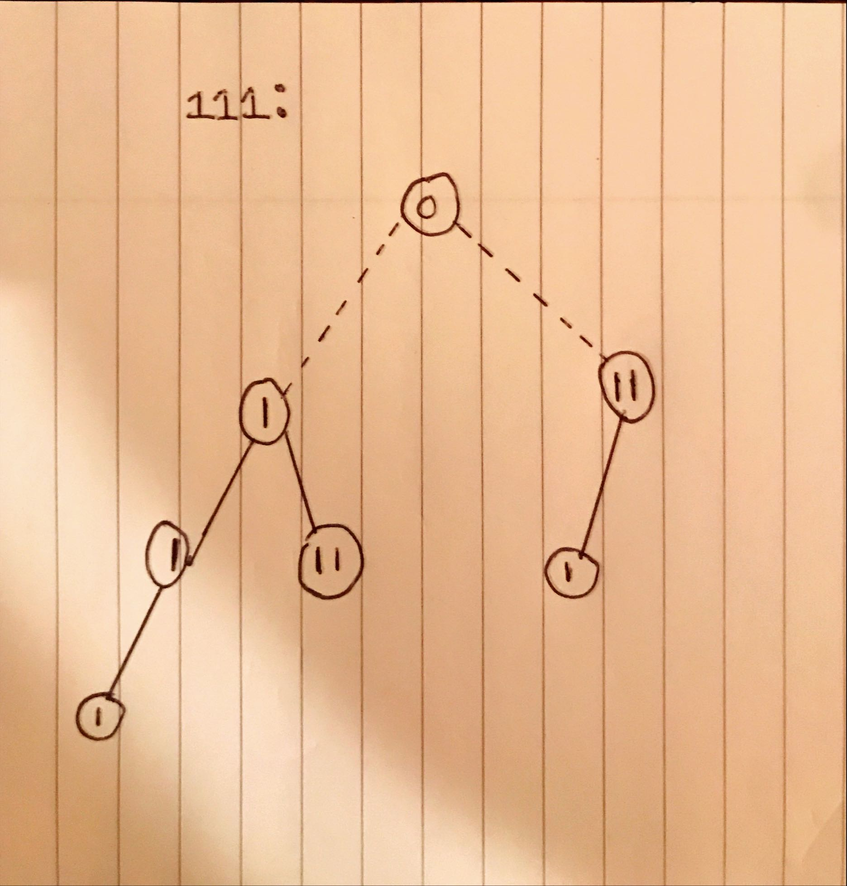
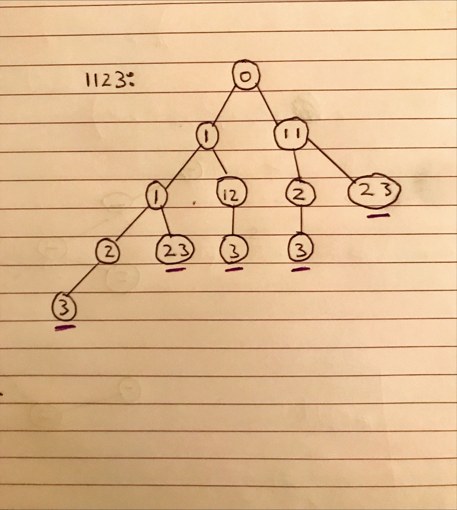
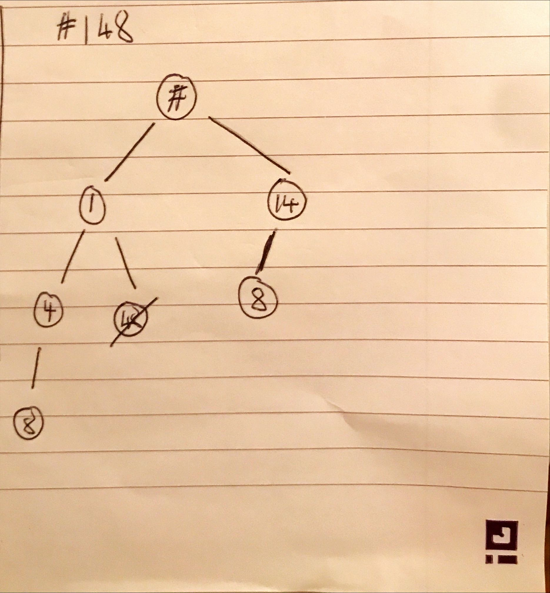

# Counting the number of possible ways to decode an encoded message

Given the mapping a = 1, b = 2, ... z = 26, and an encoded message, count the number of ways it can be decoded.

For example, the message '111' would give 3, since it could be decoded as 'aaa', 'ka', and 'ak'.

You can assume that the messages are decodable. For example, '001' is not allowed

## Approaching the problem
To begin with, I considered whether you could simply consider the number of possible options for each character in the decoded message. For example, for '111' the first letter of the decoded message could be '1' or '11', and so on. However, it is not as simple as that, since different options for previous chracters exclude/allow different options for subsequent ones - i.e, in the above example, '11' for character one excludes the possibility of '11' for character 2. 

Therefore, I decided to represent the varios possibilitys in a binary tree, where each node represents a possible character, and its (up to) two children are the possibilities for the next one. Put another way, each child will be the root of subtree representing all the future possibilities from that point. For example, for the message '111' we have the binary tree:
<div>
   
</div>    
(note the 0 at the top of the tree does not represent a character, it simple shows the split in possibilities for character one, and hence allows the two subtrees to be combines into one binary tree)  
    
Each possible combination of letters for the decoded message is represented by a single branch of the tree. Therefore, counting the total possibilities is as simple as counting the leaves on the tree. For example, in the image above the total number of possibilities is 3.  

A more interesting example is given below, for the message '1123', which shows that their are 5 possibilities: 
<div>
   
</div>
Finally, an example with larger integers is shown below, which is significant since nodes with a value > than 26 need to be discared by the program, since z = 26 is the largest number in the alphabet. The following message '148' can therefore be seen to have only 2 possibilities:
<div>
   
</div>


## The Coding
From the approach deatiled above, it was clear that the program would have to be able to create a binary tree in the style shown above for any given message. It would then need to be able to count the number of leaves on the tree, which would give it the answer for the number of possibilities. 
### Creating the tree
The function *create_tree* takes a message as input and returns the required binary tree structure. It calls itself recursively to create the whole tree. The parameters a,b are used to keep track of what point in the message is being converted to a node. Recursion breaks when either the paremeters exceed the length of the message, or when it attempts to create a node with a value > than 26, since 26 is z in the alphabet.  
(note that a 0 should be added to the start of an input message to represent the root node)


```python
class Node:
    def __init__(self, val, left=None, right=None):
        self.val = val
        self.left = left
        self.right = right


def create_tree(message,a=0,b=0):
    if (a > len(message)-1 or b > len(message)-1) or (int(message[a:b+1])>26):   
        return None
    tree = Node(message[a:b+1],create_tree(message,b+1,b+1),create_tree(message,b+1,b+2))
    return tree    

```

### Counting the leaves
The function *count_leaves* takes a binary tree representation of a message as input, and outputs the number of leaves - i.e, the number of possible ways to decode the message. The base case, which breaks the recursion, is if the input node is null (the non-existant children of the leaves), in which case the function returns 0. Else the number of possibilities branching from a particular node are equal to *count_leaves(left_branch)* + *count_leaves(right_branch)*, where if the node in question is in fact a leaf, 1 is added to the count.  
The function *is_leaf* is a simple helper function which can determine for a given node whether it is a leaf or not. 


```python

def is_leaf(node):
    if node.left == None and node.right == None:
        return True
    else:
        return False    


def count_leaves(node):
    if node == None:    
        return 0
    total_count = count_leaves(node.left) + count_leaves(node.right)    
    if is_leaf(node):
        total_count += 1   
    return total_count    
```

### Testing
The program was tested on the following messages, '111', '1123', and '148', each with the correct answer:


```python
test_tree1 = create_tree('0111')
print(count_leaves(test_tree1))

test_tree2 = create_tree('01123')
print(count_leaves(test_tree2))

test_tree3 = create_tree('0148')
print(count_leaves(test_tree3))
```

    3
    5
    2
    
